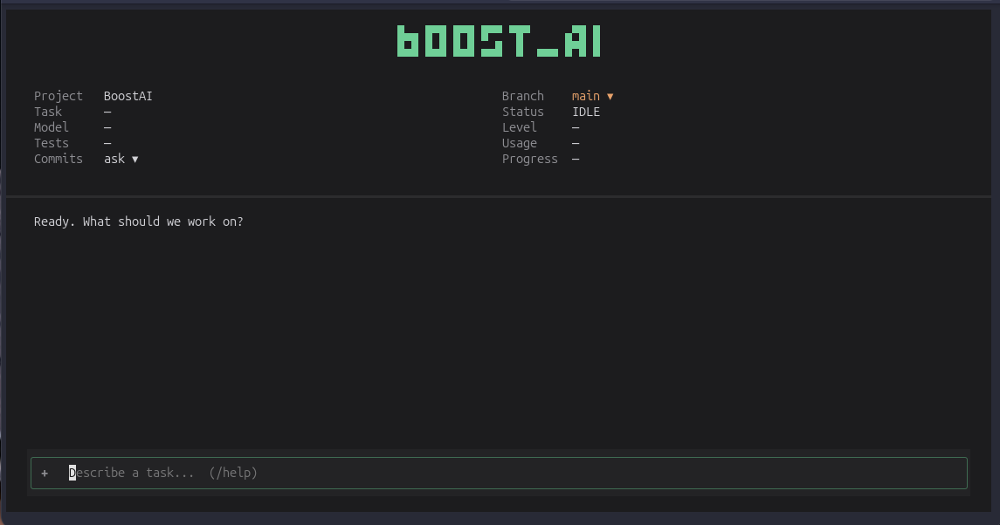
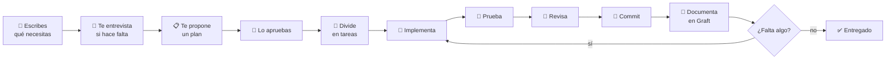

<p align="center">
  
</p>

<p align="center">
  
  
  
  
  
  
  
  
  
  
  <a href="LICENSE"></a>
</p>

<p align="center"><b>Un harness local y minimalista para programar con agentes de IA desde la terminal.</b></p>

Le describes en lenguaje normal lo que necesitas y BOOST_AI elige el agente adecuado
(Claude Code, Codex, DeepSeek), le prepara el contexto, le hace proponer un plan, verifica
cada cambio con tus tests y tu linter, pide revisión cuando el cambio es delicado y solo hace
commit cuando tú lo apruebas. **Nunca hace push por su cuenta.**



---

## ¿Qué problema resuelve?

Si usas agentes de IA para programar, seguramente ya te pasó lo siguiente:

- El agente cambia cosas sin que tú hayas aprobado el plan.
- Dice que terminó, pero los tests fallan.
- Usas el modelo más caro para tareas triviales, o el más barato para tareas delicadas.
- Hace commits (o push) que no querías.
- Cada sesión empieza de cero y no sabe qué decidiste antes.

BOOST_AI no es otro agente. Es la **capa que pone orden alrededor de los agentes que ya usas**:

| Sin BOOST_AI | Con BOOST_AI |
|---|---|
| Tú eliges el modelo en cada caso | Clasifica la tarea (L0–L4) y elige runtime y modelo |
| El agente cambia código sin más | Primero hay un plan en solo lectura y lo apruebas tú |
| "Listo" sin pruebas | Corre tus tests y tu lint después de cada intento y reintenta si fallan |
| Un solo agente se revisa a sí mismo | En tareas de riesgo (L3+), **otro** agente revisa el cambio |
| Commits y push automáticos | Commit solo con tu aprobación (o con auto-commit activado), y el push siempre lo haces tú |
| Sin memoria | Cada tarea deja un registro: resumen, decisiones, archivos, commit y verificación |

## Cómo funciona, en una mirada



### El flujo completo

```mermaid
flowchart TD
    U(["👤 Usuario escribe una historia<br/><br/>Ejemplo:<br/>'Necesito agregar login con Google'"])

    U --> H["BOOST_AI recibe el mensaje"]

    H --> ATT{"¿Adjuntaste archivos,<br/>imágenes o PDFs?"}

    ATT -- "sí" --> SAVE["Guarda los adjuntos<br/>dentro del estado de la tarea"]
    ATT -- "no" --> TRIAGE
    SAVE --> TRIAGE

    TRIAGE["Analiza la solicitud<br/>TRIAGE"]

    TRIAGE --> LEVEL["Determina complejidad y riesgo<br/>L0 · L1 · L2 · L3 · L4"]

    LEVEL --> ROUTE["Selecciona el runtime adecuado<br/>DeepSeek / Claude / Codex"]

    ROUTE --> ISOLATE{"¿La tarea es sensible<br/>o compleja? L3+"}

    ISOLATE -- "sí" --> WT["Crea rama + worktree aislado"]
    ISOLATE -- "no" --> CTX["Trabaja sobre el repo actual"]

    WT --> CTX

    CTX["Prepara contexto<br/><br/>• reglas del proyecto<br/>• AGENTS.md<br/>• historial<br/>• Graft<br/>• skills<br/>• tests/lint"]

    CTX --> PLAN{"¿Necesita plan?<br/>L2+ o tiene adjuntos?"}

    PLAN -- "no" --> EXEC

    PLAN -- "sí" --> READ["Agente explora el proyecto<br/>en SOLO LECTURA"]

    READ --> QUESTION{"¿Le falta información?"}

    QUESTION -- "sí" --> ASK["💬 BOOST_AI te pregunta<br/>lo necesario"]
    ASK --> ANSWER["👤 Tú respondes"]
    ANSWER --> READ

    QUESTION -- "no" --> SHOW["BOOST_AI te muestra:<br/><br/>• objetivo<br/>• decisiones<br/>• tareas<br/>• skills a utilizar"]

    SHOW --> APPROVE{"👤 ¿Apruebas el plan?"}

    APPROVE -- "Cambios" --> FEEDBACK["Indicas qué cambiar"]
    FEEDBACK --> READ

    APPROVE -- "Detener" --> STOP(["⛔ STOPPED"])

    APPROVE -- "Sí" --> EXEC["Empieza ejecución"]

    EXEC --> TASK["Toma SOLO la siguiente tarea<br/>Task 1/N"]

    TASK --> AGENT["🤖 Agente implementa<br/>usando código + Graft + skills"]

    AGENT --> VERIFY["BOOST_AI ejecuta<br/>tests + lint"]

    VERIFY --> PASS{"¿Pasaron?"}

    PASS -- "no" --> RETRY["Devuelve el error al agente<br/>y reintenta"]

    RETRY --> LIMIT{"¿Superó intentos?"}

    LIMIT -- "no" --> AGENT

    LIMIT -- "sí" --> ESC["👤 Te pregunta:<br/>Retry / cambiar modelo / detener"]

    ESC -- "Retry" --> AGENT
    ESC -- "Cambiar modelo" --> AGENT
    ESC -- "Stop" --> STOP

    PASS -- "sí" --> REVIEW{"¿La tarea es L3+?"}

    REVIEW -- "sí" --> REV["Otro agente revisa el cambio<br/>en SOLO LECTURA"]

    REV --> VERDICT{"¿Review aprobado?"}

    VERDICT -- "no" --> FIX["Implementador recibe<br/>los hallazgos"]
    FIX --> AGENT

    VERDICT -- "sí" --> COMMIT

    REVIEW -- "no" --> COMMIT["BOOST_AI prepara el commit"]

    COMMIT --> COMMITQ{"¿Auto-commit activo?"}

    COMMITQ -- "no" --> APPROVEC["👤 Te pide aprobación<br/>del commit"]
    APPROVEC --> DOC

    COMMITQ -- "sí" --> DOC["Commit creado"]

    DOC --> GRAFT["Actualiza Graft<br/>con las nuevas decisiones<br/>y conocimiento"]

    GRAFT --> MEMORY["Guarda memoria de la tarea<br/><br/>• resumen<br/>• decisiones<br/>• archivos<br/>• commit<br/>• verificación"]

    MEMORY --> MORE{"¿Quedan tareas<br/>del plan?"}

    MORE -- "sí" --> TASK
    MORE -- "no" --> DONE(["✅ Entrega terminada<br/><br/>Código verificado<br/>Commits creados<br/>Decisiones documentadas"])

    DONE --> PUSH["👤 El push queda bajo tu control"]
```

<details>
<summary>Ver el diagrama detallado (cada decisión del harness)</summary>



</details>

---

## Conceptos clave

Si es la primera vez que ves BOOST_AI, estas son las ideas que necesitas:

- **Tarea = conversación.** Cada mensaje que envías es un turno dentro de la misma tarea. El
  agente conserva su sesión, así que no tienes que repetir el contexto. `/new` empieza otra.
- **Runtime.** Es el agente que hace el trabajo: el CLI de **Claude Code**, el de **Codex**,
  **DeepSeek** (a través del CLI de Claude, cobrado a tu saldo de DeepSeek) o, si lo activas,
  **Antigravity**. BOOST_AI los lanza como subprocesos con tu propio login.
- **Niveles L0–L4 (triage).** Cada tarea se clasifica por complejidad y riesgo:

  | Nivel | Qué significa | Ejemplo | Qué activa |
  |---|---|---|---|
  | L0 | Pregunta o cambio trivial | "¿Qué hace este archivo?" | Modelo barato |
  | L1 | Cambio pequeño | "Agrega hello.py" | Modelo barato |
  | L2 | Cambio normal | "Pagina este endpoint" | Plan previo |
  | L3 | Sensible (auth, seguridad…) | "Login con Google" | Plan + worktree aislado + revisión cruzada |
  | L4 | Crítico (migraciones, pagos, producción) | "Migra la tabla de usuarios" | Lo mismo que L3, con el modelo más fuerte |

  Las reglas de riesgo son deterministas y actúan como piso (por ejemplo, auth → al menos L3).
  Una llamada pequeña a DeepSeek puede afinar el nivel, pero nunca baja de ese piso.
- **Plan.** En L2+ o cuando adjuntas archivos, el agente primero explora en **solo lectura** y
  te propone objetivo, decisiones, tareas y skills. No se escribe nada hasta que apruebas.
- **Verificación.** Después de cada intento BOOST_AI corre los comandos de tu proyecto
  (`commands.test`, `commands.lint`…). Si fallan, le devuelve el error al agente y reintenta.
  Si sigue fallando, te pregunta si reintentar, cambiar de modelo o detener.
- **Revisión cruzada.** En L3+ un agente **distinto** del que implementó revisa el diff en
  solo lectura. Si pide cambios, decides tú: corregir, aceptar o detener.
- **Worktree.** Las tareas L3+ trabajan en una copia aislada (`.boost-ai/worktrees/`), así que
  tu checkout no se toca mientras el agente trabaja. Cada commit aprobado llega a tu rama.
- **Graft.** Es un grafo del repositorio (archivos, símbolos, quién llama a quién) que los
  agentes consultan en vez de leer archivos enteros. Ahorra tokens y da contexto preciso.
- **Skills y rules.** Las *skills* son conocimiento opcional que el agente lee solo cuando le
  sirve (TDD, revisión de seguridad, diseño frontend…). Las *rules* son obligatorias y se
  envían completas en cada plan, implementación y revisión.
- **Memoria.** Cada turno que cambia código deja un registro en `.boost-ai/state/memory/`.

---

## Requisitos

### Obligatorios

| Dependencia | Para qué | Instalación |
|---|---|---|
| Linux | Probado en Ubuntu/GNOME | — |
| Python ≥ 3.11 | El harness | `sudo apt install python3 python3-venv` |
| Git | Diffs, worktrees y commits | `sudo apt install git` |
| Al menos un runtime con sesión iniciada | El agente que programa | ver abajo |

Las dependencias de Python se instalan solas: `textual`, `typer` y `pyyaml`.

### Runtimes (al menos uno)

| Runtime | CLI | Notas |
|---|---|---|
| Claude Code | `claude` | Runtime principal para L2+. Usa tu login del CLI, no API keys |
| Codex | `codex` | Respaldo y revisor independiente. Usa tu login del CLI |
| DeepSeek | `claude` + `DEEPSEEK_API_KEY` | Tareas L0/L1 baratas y el triage. Exporta la key en `~/.bashrc`, **nunca** en un archivo del repo |
| Antigravity | `agy` | Desactivado por defecto (`runtimes.antigravity.enabled: true` para activarlo) |

Si un runtime no está instalado, BOOST_AI lo salta y te dice por qué.

### Opcionales

| Dependencia | Para qué | Instalación |
|---|---|---|
| graft (Node.js) | Grafo de código para los agentes | `npm i -g graft` |
| zenity | Selector de archivos nativo (botón **+** / Ctrl+O) | `sudo apt install zenity` |
| notify-send | Notificaciones de escritorio | `sudo apt install libnotify-bin` |
| pw-play / paplay / aplay | Sonidos de aviso | normalmente ya vienen instalados |
| AppIndicator | Indicador en la barra superior | `sudo apt install gir1.2-ayatanaappindicator3-0.1` + extensión AppIndicator de GNOME |

Ninguna dependencia opcional bloquea el harness: si falta, esa función se desactiva.

---

## Instalación

```bash
git clone <url-de-este-repo> BoostAI
cd BoostAI
python3 -m venv .venv
.venv/bin/pip install -e '.[dev]'

# Para tener el comando `boost-ai` disponible en cualquier carpeta:
mkdir -p ~/.local/bin && ln -sf "$PWD/.venv/bin/boost-ai" ~/.local/bin/boost-ai
```

> Instálalo en modo editable (`-e`): las skills y rules viven en `harness/`, junto al
> paquete, y una instalación no editable no las incluye.

Comprueba tu entorno:

```bash
boost-ai doctor
```

```text
✓ Python         3.12.3
✓ Git            git version 2.43.0
✓ Repository     /home/tú/mi-proyecto
⚠ Project config missing
                 run `boost-ai init`
✓ Codex          codex-cli …
✓ Claude Code    … (Claude Code)
⚠ DeepSeek       DEEPSEEK_API_KEY not set
…
```

---

## Uso

### 1. Prepara tu proyecto (una vez)

BOOST_AI trabaja dentro de un repositorio git:

```bash
cd ~/mi-proyecto
boost-ai init
```

`init` crea `.boost-ai/` y detecta tus comandos de verificación (pytest, npm test, ruff…) en
`.boost-ai/config.yaml`. Revísalos: son los que deciden si un cambio "pasó".

```yaml
commands:
  test: pytest -q
  lint: ruff check .
```

**Recomendado:** escribe un `AGENTS.md` corto en la raíz con las reglas, la estructura y las
convenciones del proyecto. Se envía a cada agente.

### 2. Abre BOOST_AI

```bash
boost-ai
```

Arriba ves el estado: proyecto, rama, tarea, nivel, modelo, tests, uso de cuota, progreso del
plan y modo de commits. Abajo escribes.

### 3. Pide algo en lenguaje normal

```text
Necesito agregar login con Google
```

Lo que pasa después:

1. Clasifica la tarea (aquí L3, porque toca autenticación) y elige el runtime.
2. Crea un worktree aislado.
3. El agente explora en solo lectura y, si le falta información, te pregunta.
4. Te muestra el plan con sus tareas y las skills que usará. Puedes **aprobarlo**, **pedir
   cambios** o **detenerlo**.
5. Ejecuta las tareas una por una: implementa → tests + lint → revisión de otro agente → commit.
6. Te pide aprobar cada commit, salvo que tengas auto-commit activado.
7. Al terminar, el push lo decides tú: `!git push`.

### Adjuntar archivos

Specs, PDFs, imágenes, CSVs, logs… Usa el botón **+** o **Ctrl+O**, arrastra el archivo a la
terminal o pega su ruta. Aparece como chip (`📎 spec.pdf ✕`) y se envía con el siguiente mensaje.

### Ejecutar algo tú mismo

Empieza la línea con `!` para correr un comando sin que intervenga ningún modelo:

```text
!git switch -c feature/login
!git push
```

Los comandos peligrosos se confirman igualmente.

### Comandos

| Comando | Qué hace |
|---|---|
| `/help` | Lista de comandos |
| `/new` | Nueva conversación |
| `/history` · `/open T-0003` | Tareas anteriores · reabrir una (solo lectura) |
| `/status` · `/diff` · `/tests` · `/logs` | Tarea actual · diff completo · última verificación · ubicación de los logs |
| `/stop` | Detiene la tarea |
| `/attach [ruta]` | Adjunta archivos |
| `/interview <tema>` | El agente te entrevista por rondas y escribe una spec en `.boost-ai/specs/` lista para planificar |
| `/autocommit on\|off` | Commit automático de cada cambio terminado (el push nunca es automático) |
| `/skills` · `/skills recommend` | Skills disponibles por categoría · recomendación para este proyecto |
| `/skill add <owner/repo> [<categoría> <nombres…\|all>]` | Instala skills de un repo de GitHub (sin categoría solo las lista) |
| `/skill remove <nombre…>` | Desinstala skills |
| `/rules` · `/rule [categoría:] <texto>` | Ver las rules · agregar una obligatoria |
| `/stats` | Métricas por nivel y runtime |
| `/quit` | Salir |

### Atajos

| Atajo | Acción |
|---|---|
| Ctrl+C | Pausa: detiene al agente, sus cambios se quedan y tu siguiente mensaje continúa |
| Ctrl+C dos veces | Salir |
| Ctrl+B o clic en la rama | Cambiar de rama o crear una |
| Ctrl+T o clic en *Commits* | Activar o desactivar auto-commit |
| Ctrl+O | Adjuntar archivos |
| Ctrl+L o `clear` | Limpia la pantalla (la conversación sigue) |

### Desde la terminal, sin abrir la interfaz

```bash
boost-ai init      # prepara .boost-ai/ en el repo actual
boost-ai doctor    # revisa dependencias
boost-ai status    # qué está corriendo ahora
boost-ai stats     # métricas de eficiencia por nivel
```

---

## Skills y rules

Viven en la capa propia del harness, `harness/`, separadas por categoría. BOOST_AI **no lee ni
escribe** las carpetas de otros agentes (`~/.claude`, `~/.agents`, `~/.codex`).

```text
harness/                                  ← para todos los proyectos
  skills/<categoría>/<skill>/SKILL.md
  rules/<categoría>/*.md

<tu-proyecto>/.boost-ai/                  ← solo para ese proyecto (versionado)
  skills/<categoría>/<skill>/SKILL.md
  rules/<categoría>/*.md
```

Si una skill o rule del proyecto tiene el mismo nombre que una del harness, gana la del proyecto.

- **Skills:** al agente solo le llega `nombre [categoría]: descripción (ruta)`, y él lee el
  `SKILL.md` cuando lo necesita. Si hubo plan, solo se usan las skills que el plan aprobado nombró.
  BOOST_AI incluye una suite curada y fijada a versiones concretas (arquitectura, frontend,
  seguridad, QA, debugging, code review…). Su origen y licencia están en
  [`harness/skills/SUITE.md`](harness/skills/SUITE.md).
- **Rules:** se envían completas, sin recortar, al plan, a la implementación y a la revisión.
  Una violación cuenta como hallazgo "high".

```text
/rule git: Los commits siguen Conventional Commits
/skill add anthropics/skills frontend frontend-design
```

---

## Configuración

Cada nivel sobrescribe al anterior:

```text
boost_ai/defaults.yaml  <  ~/.config/boost-ai/config.yaml  <  <proyecto>/.boost-ai/config.yaml
```

Lo que más se suele ajustar:

```yaml
routing:
  policy:                      # runtimes preferidos por nivel, el mejor primero
    L0: [deepseek, claude, codex]
    L2: [claude, codex]
  attempts_per_runtime: 2      # intentos antes de proponer escalar
  worktree_min_level: 3        # desde qué nivel se aísla en un worktree

runtimes:
  claude:
    models: {L0: haiku, L1: haiku, L2: sonnet, L3: opus, L4: opus}

review:
  min_level: 3                 # desde qué nivel hay revisión cruzada

plan:
  min_level: 2                 # desde qué nivel hay plan previo (null lo desactiva)

git:
  auto_commit: false
```

Todas las opciones, comentadas, están en [`boost_ai/defaults.yaml`](boost_ai/defaults.yaml).

---

## Seguridad y garantías

- **Nunca hace push por su cuenta.** Fuera de un plan, después de un commit aprobado te
  pregunta "¿Push?" (`git.offer_push`); durante un plan, el push lo pides tú con `!git push`.
- **Commits solo con tu aprobación,** o con auto-commit si lo activas. El mensaje es editable,
  sigue Conventional Commits y no lleva atribución a la IA. Solo entran los archivos que tocó
  el agente: tu trabajo sin commitear no se mezcla.
- **Comandos peligrosos** del agente (force push, `rm -rf`, `reset --hard`…) pasan por un hook
  que te pide confirmación. Sin BOOST_AI corriendo, se bloquean.
- **Los agentes no pueden hacer `git commit`.** El commit es siempre de BOOST_AI.
- **Los secretos se enmascaran** (API keys, tokens, claves privadas) antes de escribir
  transcripciones, logs o memoria.
- **No inventa cifras:** el uso de cuota se muestra solo cuando hay evidencia; las estimaciones
  se marcan como `(est.)`.
- **Ningún cambio de runtime es silencioso:** siempre se te informa.

---

## Dónde guarda las cosas

```text
<tu-proyecto>/.boost-ai/
  config.yaml              configuración del proyecto (súbela al repo)
  skills/ rules/ specs/    skills, rules y specs del proyecto
  state/                   tareas, logs, adjuntos y memoria (ignorado por git)
  worktrees/               copias aisladas de las tareas L3+ (ignorado por git)

~/.config/boost-ai/config.yaml           tu configuración global
~/.local/share/boost-ai/                 métricas y uso de cuota
```

---

## Desarrollo

```bash
.venv/bin/pytest -q                    # tests (los runtimes son falsos, sin gastar cuota)
.venv/bin/pytest -q -m integration     # usa los CLIs reales y consume cuota
.venv/bin/ruff check .
```

- `boost_ai/orchestrator.py`: el ciclo completo de una tarea; empieza por aquí.
- `boost_ai/runtimes/`: un adaptador por CLI de agente (`base.py` es la interfaz).
- `boost_ai/tui/app.py`: la interfaz Textual.
- `harness/`: skills y rules del harness.
- [`docs/architecture-v1.md`](docs/architecture-v1.md): el diseño en detalle.
- [`AGENTS.md`](AGENTS.md): las reglas para quien (persona o agente) trabaje en este repo.

---

## Licencia

[MIT](LICENSE). Las skills de terceros incluidas en `harness/skills/` conservan sus propias
licencias (MIT, Apache-2.0, CC BY-SA 4.0), detalladas en
[`harness/skills/SUITE.md`](harness/skills/SUITE.md).
